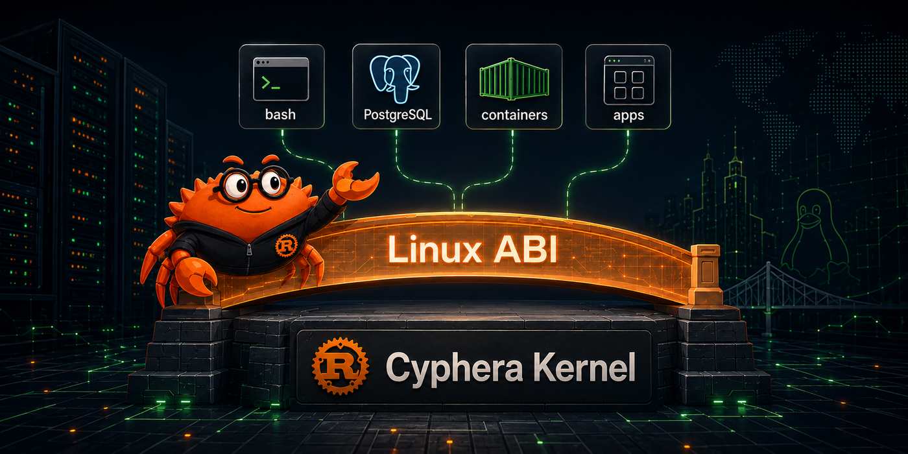

<p align="center">
  
</p>

# Cyphera Kernel

Rust is making its way into the Linux kernel one subsystem at a time.
Cyphera Kernel asks a different question: **could an entire kernel —
written in safe Rust, speaking the Linux syscall ABI — slot into
existing Linux workloads?** That's the question this project exists to
answer.

It's an independent, **pure-Rust, memory-safe** kernel that
reimplements the Linux syscall ABI, so software built for Linux runs
on it unmodified — within the syscall surface implemented so far (270
of 385; this is an early release). It targets **virtual machines** —
not bare metal — with confidential-computing deployment (SEV-SNP /
TDX) on the roadmap. By sidestepping the bare-metal driver universe,
the scope reduces to roughly 150k–250k lines of Rust.

Ambitious? Yes. A sure thing? No — that's the open question, and the
reason this ships as running code rather than a manifesto.

`#![forbid(unsafe_code)]` is enforced in the `kernel/` services
layer — the compiler rejects any `unsafe` there. The `unsafe` a
kernel genuinely needs is confined to the lower layers: the
`frame/` substrate, the boot binary (`runtime/boot/`), and the
virtio drivers (MMIO / DMA register access).

This repository is an early public source release. The project
is under active development and should not be treated as
production-ready unless explicitly documented otherwise.

Cyphera Kernel is licensed under the Apache License, Version 2.0.

Cyphera Kernel is not derived from Linux or any other existing
kernel. References to Linux are compatibility-target references
only — see [docs/CLEAN-ROOM.md](docs/CLEAN-ROOM.md) for the full
clean-room policy.

See [docs/ARCHITECTURE.md](docs/ARCHITECTURE.md) for the
strategic rationale (why VM-first, the two-layer kernel,
non-goals).

## Try it out!

This release ships the kernel source plus a **hello-world demo**:
`./dev demo` boots the kernel under QEMU + microvm and runs a small
userland ELF in ring 3; `./dev test` runs the in-tree integration
suite (the `selftests/` fixtures) against the syscall surface,
scheduler, VFS, networking, and signal paths.

**Requirements: Docker** — the pinned Rust toolchain and QEMU live
inside the dev container, so no host Rust or QEMU is needed (`./dev`
builds the image on first use). A Linux x86_64 host with `/dev/kvm` is **recommended for `./dev test`**:
`./dev` passes `/dev/kvm` through to the container when present, else
QEMU uses software emulation — under which the heavier integration
tests can exceed their per-test timeout. To run without Docker,
`./demo/run.sh` needs host `qemu-system-x86_64` plus the
`nightly-2026-03-01` toolchain + `x86_64-unknown-none` target (both
pinned in `rust-toolchain.toml`).

```sh
./dev demo            # boot the kernel + run the hello-world userland (demo/)
./dev test [kind]     # QEMU integration battery: smoke | subsystem | all (default all)
./dev run             # boot the kernel under QEMU (Ctrl-A then x to exit)
./dev build           # cargo build (debug)
./dev clippy          # cargo clippy -- -D warnings
./dev fmt             # cargo fmt --all
./dev shell           # bash inside the dev container
```

## What's verified

- **`#![forbid(unsafe_code)]`** in the `kernel/` services layer —
  the compiler rejects any `unsafe` there, so the syscall,
  scheduler, VFS, networking, and signal code is unsafe-free by
  construction. `unsafe` is confined to the audited lower layers:
  `frame/`, `runtime/boot/`, and `drivers/virtio/`.
- **MIRI gating** on key subsystems: 159 MIRI tests via the
  `host_test` feature + `frame_host` shim crate. Zero UB findings
  under stacked-borrows + data-race detection.
- **Kani formal proofs**: 120 proofs across 18 modules
  (address-range arithmetic, copy primitives, frame-allocator
  no-overlap, lock-hierarchy acyclicity, path normalization,
  capability inclusion, signal-mask combine monotonicity, PTE
  encoding, FUTEX_WAKE selection, more).
- **QEMU serial-console coverage extraction**: region-coverage
  extraction across the integration test suite (no_std + custom
  target makes this non-trivial; the extraction is documented in
  `docs/TESTING.md`).
- **Continuous fuzzing**: 24 fuzz harnesses across parser-
  shaped attack surfaces; run your own with `cargo fuzz` (see
  `docs/VERIFICATION.md`).
- **Supply-chain attestation**: every release ships Sigstore-
  anchored attestations + cosign signatures + CycloneDX +
  SPDX SBOMs. See [docs/VERIFICATION.md](docs/VERIFICATION.md)
  for the verification recipe (source audit, replay of Kani /
  MIRI / fuzz harnesses, binary inspection, cryptographic
  provenance check, local rebuild, boot/run verification).

Headline numbers:

| | |
|---|---|
| Linux-ABI x86_64 syscalls implemented | 270 of 385 (90 missing; see [docs/SYSCALLS.md](docs/SYSCALLS.md)) |
| In-tree integration tests | 80 |
| MIRI tests | 159 |
| Kani proofs | 120 |
| Fuzz harnesses | 24 |

## Architecture

```
runtime/boot/   The kernel binary: PVH ELF entry, multiboot2
                entry, long-mode bring-up, panic handler,
                kernel_main entry. Hosts integration test runners.

frame/          Hardware abstraction layer (the audited `unsafe`
                substrate): APIC, GDT/IDT, page tables, per-CPU
                storage, SMP boot, pvclock, syscall trampoline,
                IDT vectors, port/MMIO, user-memory access
                primitives.

frame_host/     Host-side stubs of `frame::` for the kernel-
                services layer to compile + run under MIRI and
                cargo-test on a developer host.

kernel/         Services layer (#![forbid(unsafe_code)]):
                syscall dispatcher, scheduler, VFS (tmpfs / devfs
                / procfs / sysfs / ext4 / cgroupfs), networking
                (smoltcp under our socket layer), signals, futex,
                ptrace, cgroups, namespaces, ELF loader, console,
                klog, etc.

drivers/virtio/ virtio drivers (mmio + pci transports): blk,
                net, rng, gpu, input, sound.

verification/   Kani proof harnesses for properties that
                frame/ + kernel/ implement (see "What's
                verified" above).

fuzz/           cargo-fuzz harnesses + corpus.

tools/          Dev container Dockerfile, run-qemu helper, ext4
                fixture maker, coverage extraction, unsafe-
                boundary checker, test wrapper.
```

## Verifying a release

Every signed release on GitHub ships:

- The kernel binary (`cyphera-kernel-vX.Y.Z.elf`) + SHA-256
- Sigstore cosign signature bundle (`.sigstore.json`)
- SLSA-style build provenance attestation (`.intoto.jsonl`)
- CycloneDX + SPDX SBOMs (signed independently)

The verification recipe in [docs/VERIFICATION.md](docs/VERIFICATION.md)
walks six layers:

1. **Source audit** — clone and read the `unsafe` (confined to
   the production sources `frame/src/`, `runtime/boot/src/`, and
   `drivers/virtio/src/`; every block carries a `// SAFETY:`
   comment, enforced by `clippy::undocumented_unsafe_blocks`), and
   cross-check `Cargo.lock` against `deny.toml`.
2. **Replay verification artifacts** — re-run the 120 Kani
   proofs, the 159 MIRI tests, and the 24 fuzz harnesses
   locally.
3. **Binary inspection** — `nm + rustfilt + ldd` against the
   release ELF to confirm Rust-mangled symbols, no dynamic
   libs, no external libc.
4. **Cryptographic provenance** — `gh attestation verify` +
   `cosign verify-blob` against the release artifact, both
   anchored in the Sigstore transparency log.
5. **Local rebuild** — build from source at the release tag
   and SHA-256-compare against the released binary. Builds
   are reproducible on a given machine; see
   [docs/REPRODUCIBLE-BUILDS.md](docs/REPRODUCIBLE-BUILDS.md).
6. **Run it yourself** — boot the kernel with `./dev demo` (a
   hello-world userland in ring 3) or run the in-tree integration
   suite with `./dev test`.

## Documentation

- [Architecture](docs/ARCHITECTURE.md) — why VM-first,
  the two-layer kernel, non-goals.
- [Verification](docs/VERIFICATION.md) — how to verify the
  source / binary / build provenance without trusting the
  maintainers.
- [Reproducible builds](docs/REPRODUCIBLE-BUILDS.md) — what makes
  the build deterministic + how to verify yourself.
- [Syscall table](docs/SYSCALLS.md) — 385 rows, one per
  x86_64 syscall, with implementation status.
- [Clean-room policy](docs/CLEAN-ROOM.md) — what we did and
  did not read while writing this.
- [Testing](docs/TESTING.md) — integration test system,
  workload fixtures, coverage extraction.

## License

Cyphera Kernel is licensed under the [Apache License, Version
2.0](LICENSE).

The kernel depends on a number of third-party Rust crates under
their respective open-source licenses (predominantly MIT and
Apache-2.0). Full attribution is in [NOTICE.md](NOTICE.md), and
the license policy enforced on dependencies is in
[deny.toml](deny.toml), checked by `cargo deny check` (run
locally / pre-release — see [SECURITY.md](SECURITY.md); not yet a
public-CI gate).

### Contribution

This is an early source release and is not yet set up to take
outside contributions. Issues and observations are welcome;
please hold pull requests for now — a contribution process will
come with a later release.
